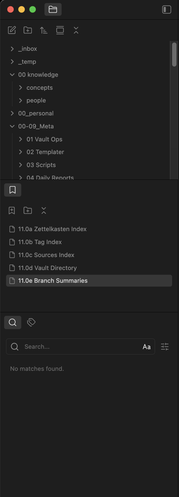
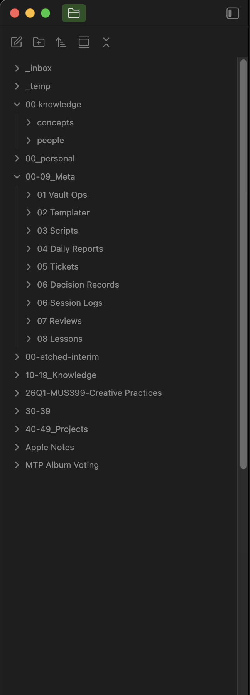
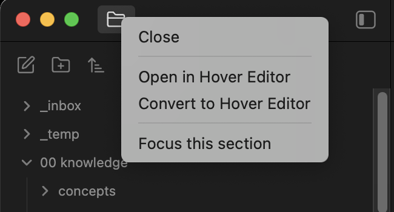
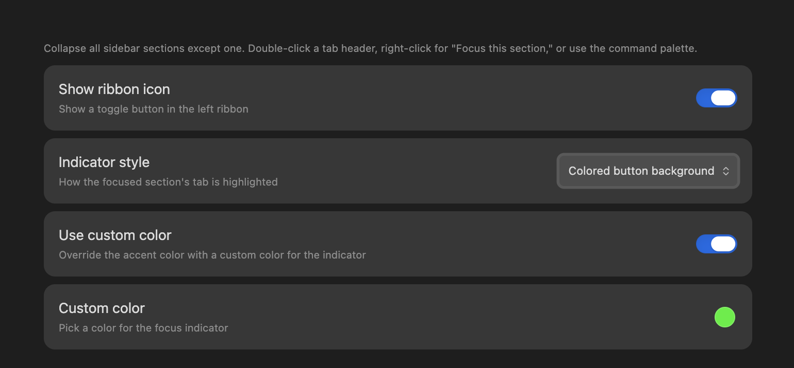

# Focused Sidebar

An Obsidian plugin that toggles any sidebar section to fill the full sidebar height.

Obsidian splits each sidebar into multiple sections that share the available height. When you want one section to have room to breathe, this plugin collapses the others and gives it the full height. Toggle again to restore the original layout.

| Before | After |
|--------|-------|
|  |  |

Double-click or right-click any tab header to focus its section:



## Usage

Multiple ways to focus:

- **Command palette:** "Toggle focused sidebar" (auto-detects left or right based on where you're working)
- **Ribbon icon:** Click the sidebar icon in the left ribbon
- **Right-click:** Right-click any sidebar tab header and choose "Focus this section"
- **Double-click:** Double-click any sidebar tab header to focus its section
- **Targeted commands:** "Focus left sidebar" and "Focus right sidebar" for direct control
- **Cycle:** "Cycle to next section" steps through sections while focused

All commands can be bound to hotkeys in Settings > Hotkeys.

## Settings

- **Indicator style** — How the focused tab is highlighted. Five options:
  - *Underline* — Bottom border only (default)
  - *Highlight* — Background tint + bottom border
  - *Glow* — Soft glow behind the icon
  - *Icon only* — Icon color change, no background effect
  - *Button* — Colored button background
- **Show ribbon icon** — Toggle the sidebar icon in the left ribbon on or off
- **Use custom color** — Override the theme's accent color with your own pick
- **Custom color** — Color picker (appears when custom color is enabled)



## How it works

The plugin saves the current section proportions, sets the target section to 100% and the others to 0%, and applies a CSS class to cleanly hide the collapsed sections. Toggling again restores the original proportions exactly.

- Disabling the plugin restores normal layout automatically
- Manually resizing while focused doesn't affect the saved proportions
- Focused state is not persisted across restarts (starts in normal mode)
- If you drag a pane to a new section while focused, focus mode exits gracefully

## Installation

### Manual

1. Download `main.js`, `manifest.json`, and `styles.css` from the latest release
2. Create a folder called `focused-sidebar` in your vault's `.obsidian/plugins/` directory
3. Copy the three files into that folder
4. Enable the plugin in Settings > Community Plugins

### Development

```bash
git clone https://github.com/blakeeboyd/obsidian-focused-sidebar.git
cd obsidian-focused-sidebar
npm install
npm run dev    # watch mode
npm run build  # production build
```

Symlink into your vault for development:

```bash
ln -s /path/to/obsidian-focused-sidebar /path/to/vault/.obsidian/plugins/focused-sidebar
```

## Roadmap

**Phase 2: Dedicated full-height row.** A new icon row above the existing sidebar sections for panes that should always display at full height. The Phase 1 toggle would remain as a separate quick-focus command.

## Platform support

Tested on macOS only. Windows and Linux should work but have not been tested. If you encounter issues on those platforms, please open an issue.

## Technical notes

- Uses unofficial but stable internal API properties (`WorkspaceSidedock.children`, `dimension`) that are used by other production plugins (Vertical Tabs, Sidebar Expand on Hover)
- Context menu injection via `monkey-around` patch on `Menu.prototype.showAtMouseEvent`
- Desktop only (mobile uses `WorkspaceMobileDrawer`, a different layout class)

## License

MIT
